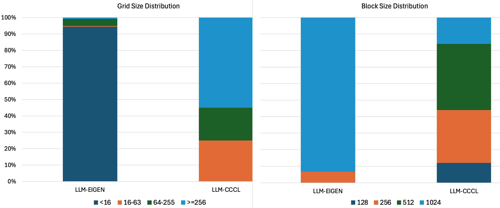
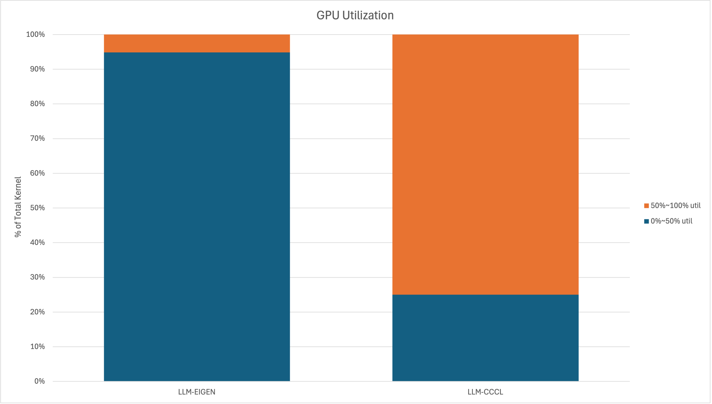

# Introduction

# The Computational Core of Modern LLMs
A prerequisite for effective performance analysis is a foundational understanding of the target software's core working mechanisms. To establish a solid baseline for our performance expectations, this section will detail the internal workings of the GPT-2 architecture as implemented in our two C++ codebases: the Eigen-Optimized Kernel [LLM-Eigen](https://github.com/zhangpiu/llm.cpp.git) and the CCCL-Accelerated Engine [LLM-CCCL](https://github.com/gevtushenko/llm.c.git) both originated from legendary Andrej Karpathy's [llm.c](https://github.com/karpathy/llm.c.git). We will illustrate how architectural and implementation choices shape the runtime behavior and performance characteristics of transformer-based models. This foundational understanding will help establish clear performance expectations and guide the deeper profiling and analysis discussed in later sections. Readers already familiar with GPT-2 internals and model execution pipelines may choose to skim this section and proceed directly to the detailed performance investigation.
To begin, let's focus on the training forward pass while ignoring batching for simplicity, as depicted in the first layer of the GPT-2 architecture diagram.


The model begins by converting the raw input text into a format suitable for computation, by breaking down into discrete tokens. These tokens are then mapped to continuous, high-dimensional vectors known as embeddings. This process, often handled via a lookup table, transforms sparse token IDs into dense, meaningful input vectors. The final input vector that enters the main transformer block combines these token embeddings with positional encodings. For both implementations, LLM-Eigen and LLM-CCCL, the main entry point is the **train_gpt2.cu** file. The training loop orchestrates the overall training process. In each iteration of this loop, a training sample and its corresponding target are loaded from the dataset, after which the forward pass of the model is executed. This forward pass forms the computational backbone of the training process, where most of the profiling and performance analysis will be focused in subsequent sections.

The code begins by allocating memory for activations, the intermediate tensors produced during forward and backward passes. The two implementations differ significantly in how they handle these allocations. The LLM-CCCL version allocates all activations in a single contiguous memory block, which reduces fragmentation and allows for efficient GPU memory access and management. In contrast, the LLM-Eigen implementation uses lazy allocation through the Eigen library's LazyAllocate mechanism, which allocates memory on demand as tensors are created. While lazy allocation provides greater flexibility when working with varying tensor shapes and sizes, for example, during inference with dynamic sequence lengths, it may not yield the most optimized implementation for fixed-size training, where a bulk contiguous buffer is typically more efficient.

The training cycle begins with the entry into the Model's Forward Function. As illustrated in the architecture diagram , the initial processing steps are consistent: the input sequence is first tokenized, and the resulting token embeddings are summed with the positional encodings. This resultant vector, forms the initial input vector for the first transformer layer. The model then iterates through all transformer layers in sequence. Except for the first layer, the output of the preceding layer serves as the input to the next layer in the sequence.

A subtle but important difference lies in how the core operations within each transformer layer are structured and executed. In the LLM-Eigen version, each layer is encapsulated as a C++ class, with its constituent blocks implemented as member functions or objects of that class. In contrast, the CCCL version utilizes a flat, procedural execution of the blocks in every layer. Another key distinction lies in the implementation of sub-blocks within each transformer layer. The LLM-Eigen version adopts a mathematical operation-by-operation approach. Each core step of the calculation is mapped directly to an Eigen operation which, in turn, results in multiple, distinct kernel launches on the device. The LLM-CCCL codebase employs a more traditional high-performance strategy, where a single, fused kernel performs the entire computation of a sub-block. All these implementation choices have a direct impact on performance, and their effects will be analyzed in detail in the performance profiling section later in this blog.

The table below highlights the specific code sections corresponding to each implementation choice in both versions, providing an easy reference for readers to correlate source code with the architectural flow shown in the accompanying figure. Together, the table and figure serve as a practical guide to understanding how a modern LLM is structured and executed at a low level.

This reference will also be valuable in the next section, where we develop the roofline performance model for each of these blocks to quantify and compare their computational efficiency and memory behavior.

| Sub Blocks | LLM-Eigen | LLM-CCCL |
|------------|-----------|----------|
|Model Forward Function|ForwardGPU @ gpt.hpp|gpt2_forward @ train_gpt2.cu|
|Token Embedding & Positional Embedding|__Forward @ gpt.hpp|encoder_forward @ train_gpt2.cu|
|LLM Layer|Block::Forward @ gpt.hpp|encoder_forward @ train_gpt2.cu|
|LayerNorm|nn::LayerNorm::Forward @ nn.hpp|layernorm_forward @ train_gpt2.cu(layernorm_forward_kernel3)|
|QKV Linear Projection|CausalSelfAttention::Forward @ gpt.hpp(c_attn_->Forward)|matmul_forward_cublaslt @ train_gpt2.cu(cublasLtMatmul)|
|Self Attention: $QK^T$|nn::MatMul::Forward @ gpt.hpp|attention_forward @ train_gpt2.cu(cublasSgemmStridedBatched)|
|Self Attention: Softmax|nn::Softmax::Forward @ gpt.hpp|softmax_forward_kernel5 @ train_gpt2.cu|
|Self Attention: Value Matmul|nn::Softmax::Forward @ gpt.hpp|attention_forward @ train_gpt2.cu(cublasSgemmStridedBatched)|
|O Linear Projection|nn::MatMul::Forward @ gpt.hpp|matmul_forward_cublaslt @ train_gpt2.cu(cublasLtMatmul)|
|Residual|nn::Residual::Forward @ gpt.hpp|residual_forward @ train_gpt2.cu|
|FeedForward: MLP1 & MLP2|MLP::Forward @ gpt.hpp nn::Linear::Forward|matmul_forward_cublaslt @ train_gpt2.cu(cublasLtMatmul)|
|FeedForward: GeLU|nn::NewGELU::Forward @ gpt.hpp|gelu_forward @ train_gpt2.cu|

# Basics of GPU

# CUPTI

CUPTI is a set of API that enables developers to both retrieve hardware counters from NVidia GPUs and trace the host-side activities on CUDA. It serves as the foundation of NSight Compute, the official GPU profiler provided by NVidia. With CUPTI, independent developers can develop customized profilers that leverage the same sets of metrics and derive their own specialized insights through custom data processing

In the big picture, CUPTI has two key functionalities:

* Tracing: collecting host-side activities, like kernel launches and memset, etc.  
* Profiling: collecting hardware counters and other derived metrics like throughput.

It can also be divided into multiple sets by the way it collects data, including

* the Activity API,  
* the Callback API,  
* the Host Profiling API,  
* the Range Profiling API,  
* the PC Sampling API,  
* the SASS Metric API,  
* the PM Sampling API,  
* the Checkpoint API,  
* the Profiling API,

For this detailed analysis, we utilized our custom tool: the **GPU Memory Profiler (GMP)** . This profiler was built atop the CUPTI's stack, leveraging both the Activities API and the Range Profiling API for fine-grained tracing and performance data collection. For the purposes of this blog, we will focus exclusively on interpreting the performance data collected.
If you'd like to explore or reproduce the tooling, we have put down the following resources:
* Source Code: [github](https://github.com/ZehaoLu98/GMP)
* Tutorial: [link](https://labmem003.blog/posts/introduction_to_cupti/introduction_to_cupti)

To profile the specific computational blocks we are interested in, such as a single GEMM operation or a complete sub-block the GMPProfiler utilizes a range-based profiling methodology. It lets you mark logical ranges by wrapping code with push/pop calls. Here is a sample code snippet illustrating how we wrapped and timed a specific range:

```cpp
  GmpProfiler::getInstance()->pushRange("MLP", GmpProfileType::CONCURRENT_KERNEL);
  GMP_TIMED("MLP", mlp_->Forward(ln2_y_2d_const, mlp_y_2d));
  GmpProfiler::getInstance()->popRange("MLP", GmpProfileType::CONCURRENT_KERNEL);
```
To avoid profiling overhead during normal runs, we provide both a compile-time flag and a runtime switch to enable/disable the profiler. When statically disabled, the application executes with no CUPTI overhead. We also expose a lightweight timing macro, GMP_TIMED, which uses C++ std::chrono to measure wall-clock time for any wrapped code region. This offers a quick way to gauge performance for a given range without invoking CUPTI. We will compare this basic wall-clock measurement with the more detailed, hardware-recorded time retrieved by CUPTI to gain insights into system-level overheads that affect overall performance.

We partitioned a transformer layer into performance-regions, as illustrated in the figure. Although our primary focus is on the two dominant, compute-heavy sections—Attention and MLP, we intentionally retained the non-compute intensive blocks. It would be interesting to understand how much they contribute to overall performance, but, as we will see, they offer interesting insights during profiling and performance analysis.

<div class="small-image">


</div>

# Performance Analysis
For our performance analysis, we will use the default, out-of-the-box parameters provided in the LLM repositories.
* Vocabulary Size ($V$): 50304 (padded)
* Number of Layers ($L$): 12
* Sequence Length ($T$): 64
* Hidden Size ($C$): 768
* Number of Attention Heads ($H$): 12
* Batch Size ($B$): 4

## Roofline Performance
Understanding a system's performance in isolation is challenging; it's far more meaningful to compare against an established baseline or rigorous theoretical limits. For our analysis, we will use the Roofline Model. Its a powerful analytical framework that defines the maximum achievable performance of a given application on a specific hardware system. It works by first determining two key application characteristics: the required computational intensity (FLOPs) and the necessary memory transfers. For a given application and hardware, relates arithmetic intensity (FLOPs per byte moved) to the machine's peak compute and peak memory bandwidth. It tells you whether a kernel is compute-bound or memory-bound, and sets a clear ceiling on the performance you can expect on that system. For a concise introduction, see the NERSC guide to the [roofline model](https://docs.nersc.gov/tools/performance/roofline/). Further references will be provided at the end of this post.

As we construct the roofline model for each sub-block in a GPT-2 layer, the first step is to quantify memory traffic. The table below enumerates the activation tensors (shapes and data types) produced and consumed by each sub-block;
| SUB BLOCKS | NUM ELEMENTS | TOTAL SIZE (MB)|
|------------|--------------|----------------|
|Input | $B * T * C$ | 0.75 |
|Layer Norm | $B * L * T * C$ | 2.25 |
|Q, K, V | $B * L * T * 3C$ | 6.75 |
|SoftMAX($QK^T$) | $B * L * H * T^2$ | 2.25 |
|O | $B * L * T * C$ | 2.25 |
|Residual | $B * L * T * C$ | 2.25 |
|MLP1 | $B * L * T * 4C$ | 9 |
|MLP GeLU | $B * L * T * 4C$ | 9 |
|MLP2 | $B * L * T * C$ | 2.25 |

Refer to the table below for a breakdown of the computations performed by each sub-block—including key operations and FLOP counts.
| SUB BLOCKS | Operations | Total OPs|
|------------|------------|----------|
|LayerNorm | Element Wise - {Mean: 1x ADD} {RSTD: 1x SQRT, 1x ADD} {Norm & Scale: 1x ADD, 1x SUB, 2x MUL} | $7 * B * T * C$|
|Q, K, V | Dense GEMM: (BT x C) x (C x 3C) | $6 * B * T * C^2$|
|$QK^T$ | Batch & Head Wise - Dense GEMM: (T x C/H) x (C/H x T)| $2 * B * T^2 * C$|
|SoftMAX |Element Wise - {1x EXP, 1x ADD, 1x DIV}| $3 * B * H * T^2$|
|V Matmul | Dense GEMM: (T x T) x (T x C/H)| $2 * B * T^2 * C$|
|O | Dense GEMM: (BT x C) x (C x C) | $2 * B * T * C^2$|
|Residual | Element Wise - {1x ADD}| $B * T * C$|
|MLP1 | Dense GEMM: (BT x C) x (C x 4C)| $8 * B * T * C^2$|
|MLP2 | Dense GEMM: (BT x 4C) x (4C x C)| $8 * B * T * C^2$|

Using these two tables, we compute the arithmetic intensity (AI) for each sub-block, classify each as compute-bound or memory-bound, and then derive its roofline performance ceiling accordingly. On A100 SXM4 we use the folloiwng parameters of the device:
* FP32 FLOPS : 19.5 TFOPS
* TF32 FLOPS : 156 TFLOPS
* HBM2E BW : 1555 GB/s

As the compute bound GEMM operations can use Tensor cores, we provide the minimum execution time using TF32 and maximum time using FP32 FLOPS. The table below walks through these steps and reports the resulting roofline limits for all sub-blocks.
|SUB BLOCKS | AI | Bound | Min Time (TF32) (us)| Max Time (FP32) (us)
|-----------|----|-------|--------------------|-----------------|
|LayerNorm | < 1 | Memory | 1.01 | 1.01 |
|Q, K, V | > 80 | Compute | 5.81 | 46.5 |
|$QK^T$ | > 10 | Compute | 0.16 | 1.29 |
|SoftMAX | < 1 | Memory | 1.01 | 1.01 |
|V Matmul | > 10 | Compute | 0.16 | 1.29 |
|O | > 76 | Compute | 1.94 | 15.5 |
|Residual | < 0.1 | Memory |  1.52 | 1.52 |
|MLP1 | > 90 | Compute |  7.74 | 61.9 |
|MLP2 | > 90 | Compute |  7.74 | 61.9 |

With our definitive Roofline Performance figures now established, we transition from theoretical limits to real-world measurement. We will examine the actual performance attained by both the LLM implemntations compare it against these theoretical ceilings to understand how closely each implementation approaches its roofline—and where performance gaps emerge.

## Kernel Invocations
The kernel launch is the mechanism by which CUDA assigns computation tasks to the GPU's Streaming Multiprocessors (SMs) with a specified grid–block–thread configuration. Kernel launches introduce inherent overhead, and choices of grid/block sizes has profound impact on system performance, can either underutilize the GPU or add excess launch/scheduling overhead. This nuanced decision-making process is a craft—balancing occupancy, memory access patterns, and launch counts. Exactly why good GPU programmers are valued, and (yes) paid handsomely in today's AI industry and this blog will take you a step in that direction. Alright, enough of the sales pitch, back to the performance that matters. For readers interested in the intricate details, NVIDIA's GTC talks and CUDA performance guides walk through the trade-offs. 
The table below provides a direct comparison of the kernel launch behavior of the two implementations. Note that LLM-Eigen relies on Eigen as its backend, which translates high-level tensor operations into multiple kernel launches, whereas LLM-CCCL directly invokes CUDA kernels for each sub-block.
|PERF-REGIONS|LLM-Eigen|LLM-CCCL|
|----------|---------|--------|
|LayerNorm 1|2|1|
|Attention|440|8|
|Residual 1|1|1|
|LayerNorm 2|3|1|
|MLP|5|4|
|Residual 2|1|1|

Comparing the forward pass implementations reveals a stark difference in kernel launch philosophy. It is immediately apparent that the LLM-Eigen version launches a significantly higher number of kernels, particularly within the Attention block. This discrepancy arises because the LLM-Eigen version relies on the Eigen backend, where mathematical operations are translated into a sequence of non-explicit kernel launches. In other words, the number of resulting kernels and their launch configurations (grid/block sizes) are highly dependent on Eigen's internal implementation and are not guaranteed to correspond to a single assignment. In contrast, LLM-CCCL fuses the sub-block's work into one global kernel per major range utilizing few helper kernels as needed. Lets dig deeper into its implementation of Attention to explain the large discrepency.

LLM-Eigen version's enormous 440 kernel launches in the attention stems from the factor that how the code is structured. It relies on nested loops (over sequence, heads) combined with fine-grained tensor operations. When coupled with per statement wise kernel launch the overall kernel count just blows up. In contrast, the LLM-CCCL expresses Attention using a single basic block of code that intelligently calls cuBLAS Batched GEMM to aggregate work across batches/heads into larger batched operations. The distinction, therefore, lies in fundamental design philosophy: the Eigen approach favors simplicity of expression (using standard C++ loops and libraries), whereas the CCCL approach favors maximum hardware utilization. With a batch size ($B$) of 4 and 12 attention heads ($H$), this design choice introduces a 48x iteration difference that significantly amplifies the total number of kernel launches as observed.

Below is the code snippet illustrating how the attention module is structured for both the versions:

```cpp
// LLM-Eigen Attention Implementation
for (int b = 0; b < B; ++b)  
{  
    for (int h = 0; h < NH; ++h)  
    {  
        // Calculate QK^T
        nn::MatMul::Forward(q2d, k2d, preatt2d, factor);

        // softmax
        nn::Softmax::Forward(preatt2d_tensor, preatt_softmax2d_tensor);

        // att * V
        nn::MatMul::Forward(preatt_softmax2d, v2d_const, att2d);
    }  
}

// LLM-CCCL Attention Implementation

// Calculate QK^T
cublasCheck(cublasSgemmStridedBatched(cublas_handle, CUBLAS_OP_T, CUBLAS_OP_N, T, T, HS, &alpha, k, HS, T * HS, q, HS, T * HS, &beta, preatt, T, T * T, B * NH));

// softmax
softmax_forward_kernel5<<<grid_size, softmax_block_size>>>(att, scale, preatt, B * NH, T);

// att * V
cublasCheck(cublasSgemmStridedBatched(cublas_handle, CUBLAS_OP_N, CUBLAS_OP_N, HS, T, T, &alpha, v, HS, T * HS, att, T, T * T, &beta, vaccum, HS, T * HS, B * NH));

```

Another key aspect to understand when analyzing GPU kernels is the grid and block dimensions. The figure below show the distribution of grid and block sizes across all the kernels.



The results clearly show a dramatic difference in launch configuration granularity. The LLM-Eigen implementation tends to launch the vast majority of its kernels with only a handful of blocks (often single-digit count), whereas the CCCL implementation launches the majority of kernels with >= 256 blocks. The following table shows this glaring discrepency in another light:

<center>Grid Size Statistics</center>

|  | LLM-Eigen | LLM-CCCL |
| :---- | :---- | :---- |
| min block | 1 | 16 |
| max block | 3144 | 1536 |
| mean block | 3 | 159 |
| median block | 4 | 320 |
| avg warp/block | 24 | 8 |

This has significant implications for GPU compute utilization. On an A100 with 108 SMs, small-grid kernels from the Eigen launching kernels with only a few blocks means that most SMs remain idle leading to severe underutilization of compute resources. 

We define the SM Utilization of a GPU as: $$ \frac{\min(4, BlockSize/WarpSize)}{4} $$

and GPU Utilization as: $$ \frac{\min(NumSM, GridSize)}{NumSM} \times SM Utilization $$

Since each SM is subdivided into partitions (typically four sub-partitions in Ampere and Hopper), a minimum of four warps is generally required to maintain compute efficiency within a single SM. Similarly, to ensure all SMs are engaged across the entire GPU, the number of launched blocks should be at least equal to the number of SMs on the device. The formula above is a very simplified model of warp scheduling and SM occupancy, intentionally omitting many architectural complexities (e.g., register file pressure, shared-memory, ILP limits, warp divergence) to keep this blog focused and practical. In reality, optimal occupancy depends on the interaction of these factors, not just raw counts of blocks and warps. Achieving the absolute maximum FLOPs often requires the GPU utilization metric to be as close to $1.0$ (or 100%) as possible. It is critical to recognize that if the kernel is not compute-bound, driving utilization to ~1.0 may not increase performance and often lead to wasted energy.

The block-size distribution shows that most kernels are launched with large blocks, providing enough warps per block to keep the schedulers (and SM) busy. Given the simplified utilization model above, the primary factor determining performance then boils down to the grid size (the number of blocks). The GPU utilization chart below validates our earlier deduction: LLM-Eigen spends most of its time below 50% utilization, whereas in LLM-CCCL only about one quarter of kernels fall below 50%. This profound difference in hardware usage directly materializes as performance disparity, which we will now investigate in terms of real training time impacts.



## Training Time
Measuring layer training time has two perspectives:
* GPU Time: This is the duration measured while the kernel(s) are actively executing on the GPU hardware. In our case here it is collected from hardware counters per kernel through CUPTI. For a range, we add the gpu\_\_time\_duration.max of all the kernels within it.
* Overall Time (Wall-Clock Time): This is the end-to-end time experienced by the user when the training process is executed from the CPU host. We use C++ std::chrono::high_resolution_clock::now() followed by a cudaDeviceSynchronize() to wrap the code snippet. It is a comprehensive metric comprising:
  * The GPU execution time,
  * The CPU execution time (host-side logic, data preparation like makespan, makeMatrix, synchronized cuda memory copy/memset, etc.), and
  * Various overheads, primarily kernel launch latency and synchronization cost.

Note that by default the kernel launch is asynchronous and launching a kernel will only push it into a queue but not execute it. As we perform device synchorization in the C++ marcro, our wall clock time includes the GPU execution time. Another popular way of measuring this time would be through [cudaEventRecord](https://docs.nvidia.com/cuda/cuda-runtime-api/group__CUDART__EVENT.html) mechanism.

The table below shows the GPU execution time alongwith the roofline as calculated above. All values are in **micro seconds (us)**
|PERF-REGIONS|Roofline-Min|Roofline-Max|LLM-Eigen|LLM-CCCL|CCCL Speedup|
|------------|------------|------------|---------|--------|------------|
|LayerNorm 1| 1.01 | 1.01 | 569.7 | 15.5 | 36x |
|Attention| 9.08 | 65.5 | 2882.5 | 60.5 | 48x |
|Residual 1| 1.52 | 1.52 | 3.7 | 3.8 | 1x |
|LayerNorm 2| 1.01 | 1.01 | 569.7 | 15.5 | 36x |
|MLP| 15.5 | 124| 551.2 | 49.3 | 11x |
|Residual 2| 1.52 | 1.52 | 3.9 | 4.2 | 1x |

The results of our comparative analysis reveal several interesting and crucial performance characteristics:
1. The Gap Between Theory and Reality: While the Roofline Model clearly provides the theoretical performance bounds, real-world implementations are often significantly far from reaching that limit. Closing this gap requires targeted profiling and optimization.
2. Compute Efficiency in CCCL: The Attention and MLP blocks (backed by cuBLAS) achieve high compute utilization.
3. Performance Dominance of CCCL: With the exception of the Residual block, the CCCL implementation consistently outperforms the Eigen implementation by a huge margin across the entire LLM layer.
4. Eigen's Bottleneck: As anticipated, the LLM-Eigen implementation suffers from extremely low performance. This is a direct consequence of its abysmally low GPU utilization due to small grid size.

Now we analyze the overall timing (in micro-seconds) of the performance regions as presented in the table here. The GPU execution time is provided in paranthesis for ease of reference:
|PERF-REGIONS|LLM-Eigen-|LLM-CCCL|CCCL Speedup|
|------------|----------|--------|------------|
|LayerNorm 1| 580 (570) | 30 (16) |  19x (36x) |
|Attention| 5817 (2880) | 101 (61) |  58x (48x) |
|Residual 1| 18 (4) | 17 (4) |  1x (1x) |
|LayerNorm 2| 581 (570) | 30 (16) |  19x (36x) |
|MLP| 1003 (551) | 86 (49) |  12x (11x) |
|Residual 2| 19 (4) | 18 (4) |  1x (1x) |

The results make it clear that the non-GPU portion of runtime is significant and cannot be ignored. To reach peak performance, system-level optimization spanning CPU, GPU, memory, storage, and network/data pipelines is often just as important as kernel efficiency. Focusing on the Attention block, Eigen’s many small kernel launches (versus CCCL’s single cuBLAS batched GEMM) amplify overheads, widening the gap from 48x on GPU time to 58x on overall wall-clock time.

The chart below shows how execution time is distributed across major performance regions.


As anticipated, the Attention block consumes the largest fraction of the total time, closely followed by the MLP block. Even the memory-bound LayerNorm (memory bound) operation contributes a non-negligible amount of time. For the Eigen implementation, Attention dominates: it consumes ~63% of GPU time, and—once kernel-launch overheads are included ~73% of overall time. LLM-CCCL's highly optimized Attention is far more efficient, consuming only about 35% to 40% of the overall execution time. One highly interesting point we must bring forth is the comparison against the Roofline Model. The model predicted that the MLP block should have a greater contribution to total time than the Attention block. However, for both implementations, the reality we measured shows that Attention consistently takes more time than MLP. We have not fully isolated the root cause, but we think Attention kernel launches, associated launch/synchronization overheads, and less favorable data movement, which together inflate Attention’s cost relative to the MLP.

Next, we take a deeper look at the memory behavior of the two implementations by analyzing metrics such as instruction mix, cache behavior, and memory access patterns.

## Memory Performance Profile
### SASS Instructions
SASS (Streaming Assembler) is the low-level assembly language executed by NVIDIA GPUs, the final compiled form of CUDA kernels. While CUPTI can collect a broad range of SASS metrics, for the purpose of this memory-focused blog, we will concentrate specifically on the global load/store instructions and the corresponding bytes read from and written to global memory as this provides the direct information about the data traffic imposed on the High Bandwidth Memory (HBM) subsystem by each LLM implementation. Before we deep dive here is an example sample from the Residual performance region chosen for simplicity of analysis as it performs a $A = B + C$ operation on vectors.

| Metric | LLM-Eigen | LLM-CCCL |
| :---- | :---- | :---- |
| smsp\_\_sass\_data\_bytes\_mem\_global\_op\_ld.sum | 1,572,864 | 1,572,864 |
| smsp\_\_sass\_data\_bytes\_mem\_global\_op\_st.sum | 786,432 | 786,432 |
| smsp\_\_sass\_inst\_executed\_op\_global\_ld.sum | 3,072 | 12,288 |
| smsp\_\_sass\_inst\_executed\_op\_global\_st.sum | 1,536 | 6,144 |

* The metrics are reported on a **warp** basis.
* smsp\_\_sass\_data\_bytes\_mem\_global\_op\_ld.sum is the total number of global load instructions issued. Note that this doesn't include atomic loads,which are collected in other metrics. 
* smsp\_\_sass\_data\_bytes\_mem\_global\_op\_ld.sum represents the actual data loaded by the instructions.
* There are analogous store instructions.

As expected there are 2x load instructions and bytes compared to stores. Its interesting to notice a significant difference in instruction counts despite both implementations loading and storing the exact same total amount of data, the LLM-Eigen version executes only approximately one-quarter of the instructions compared to the LLM-CCCL version. This efficiency is achieved because the Eigen backend employs vectorized loads for contiguous memory elements. This optimization means that each single global load instruction retrieves, for instance, four floating-point elements instead of just one, dramatically reducing the total instruction count required to move the same volume of data. More background on advantages of Vectorized Memory Access is presented in [CUDA profile tip](https://developer.nvidia.com/blog/cuda-pro-tip-increase-performance-with-vectorized-memory-access/).

### L1, L2 and HBM accesses
As instructions execute in CUDA threads, their memory accesses may be coalesced and then propagated through the L1 and L2 caches before finally reaching HBM. The chart below shows the distribution of all relevant memory-related metrics across our partitioned performance regions. As can be seen, the Attention and MLP blocks consistently dominate most of these metrics, but they do so with some interesting differences, which we highlight below.


* The Attention and MLP blocks collectively account for more than $95\%$ of all accesses to the memory hierarchy. The contribution from the next most important block, Layer Norm, appears meager, registering only $1\%$ to $3\%$ of total memory accesses. However, from an execution-time perspective, even this relatively small LayerNorm share ends up consuming $20–25\%$ of the total time, because it is strongly memory-bound.

First, if we compare Attention and MLP in terms of global loads, we see that Attention accounts for roughly half as many global loads as the MLP.
* The LLM-Eigen implementation consistently maintains this $\approx 50\%$ ratio for the Attention block's memory contribution over MLP across the entire hierarchy, from instruction count all the way down to the HBM reads.
* The LLM-CCCL version shows that the actual load instructions and total bytes are initially the same for both blocks. However, as the requests travel down the memory hierarchy, starting at the L1 and L2 caches, the contribution from the Attention block begins to reduce. It eventually culminates at the HBM level where the total number of HBM reads made by the Attention region is precisely half of the HBM reads made by the MLP region.

For global stores, the picture is slightly different. In the LLM-Eigen implementation, Attention’s SASS store instructions, L1 requests, and L2 accesses are all roughly 30% higher than those in the MLP region. In the LLM-CCCL implementation, the same quantities are about 10% higher for Attention than for MLP. However, at the HBM level, the pattern mirrors what we observed for loads: Attention ends up with roughly half as many HBM store transactions as the MLP region.

Crucially, this memory behavior directly contrasts with the actual GPU execution time due to compute boundness of these regions. As previously analyzed, the Attention block consumes approximately $20\%$ more execution time than the MLP block in the optimized LLM-CCCL implementation. For the LLM-Eigen implementation, this disparity is vastly exaggerated, with the Attention block consuming more than five times the execution time of the MLP block due to the significant overhead imposed by multiple kernel invocations and the resultant under-utilization that we have thoroughly documented throughout this blog.

|Attention/MLP | LLM-Eigen | LLM-CCCL |
|--------------|-----------|----------|
|Global Load Instructions | 0.5 | 1.1 |
|Global Store Instructions | 1.3 | 1.1 |
|Global Load Bytes | 0.5| 1.0 |
|Global Store Bytes | 1.4 | 1.1 |
|L1 Load Requests | 0.5 | 0.7 |
|L1 Store Requests | 1.3 | 1.1 |
|L1 Load Sectors | 0.6 | 0.6 |
|L1 Store Sectors | 1.3 | 1.1 |
|L2 Load Sectors | 0.5 | 0.6 |
|L2 Store Sectors | 1.3 | 1.1 |
|HBM Sectors Read | 0.5 | 0.5 |
|HBM Sectors Write | 0.5 | 0.5 |
|GPU Time | 5.2 | 1.2 |
|Overall Time | 5.8 | 1.2 |


### HBM throughput

Finally, after requests have been filtered through L1 and L2, they reach dram, whose bandwidth greatly affects the overall performance of the system. CUPTI provides dram\_\_throughput.avg.pct\_of\_peak\_sustained\_elapsed, a percentage showing how much of theoretical sustained peak throughput one kernel can use, but this metrics only measures per kernel throughput. If we calculate the average throughput through adding all the metrics in range and divide by number of kernels in range, in some extreme cases, it may show misleading throughput because it loses the information of time. For example, if we have 1 kernel that heavily utilizes 100% throughput for an hour and 99 kernels use 0% in just 1 second, we will get an average usage of 1%, which looks pretty off. Therefore, instead of directly averaging the throughput metrics provided by CUPTI, we calculate the overall throughput by doing

$$DramThroughput = \frac{(DramReadSectors + DramWriteSectors) \times 32}{GpuTime}$$

Here is the data we produced:

![][dram-throughput]  

From the chart, we can find that generally the CCCL version consumes more dram throughput than the Eigen one. Previously we talked about the low grid size of the Eigen version. The low SM utilization will lead to slow issue rate of load and store instructions, causing low throughput. Remember the average grid size for Eigen implementation is 3. This makes most of the SM inactive, not being able to commands and leave the remaining throughput wasted. 

Another reason might be  the GPU time of the range. If we refer back to the prior section, we can find that the CCCL version takes less than 1/10 GPU time of the Eigen ones. Our equation of the throughput indicates that the denominator is the GPU time. With the same amount of dram loads and stores, the bandwidth will be multiple times higher if the time is as short as that. The reduced time of the CCCL llm.cpp indicates a better usage of dram bandwidth over leaving the bandwidth wasted for a long period of time.

Finally, the layer norms barely accessed the dram in both implementations. This is expected because the calculation of the norms doesn't involve any parameters. All it needs is to load the previous activations and store the result norm. As L2 will not be flushed across kernels, the activation produced by the previous range should still reside in the L2. Therefore even if there will be SASS  loads and L1 requests, these accesses will be filtered out by L2 and keep the dram intact. That's another reason to explain layer norms use such a little throughput in both implementations other than the grid size.  

[kernel-num]: <kernel-num.png>
[forward-wallclock-time]: <forward-wallclock-time.png>
[forward-wallclock-time-ratio]: <forward-wallclock-time-ratio.png>
[kernel-num-ratio]: <kernel-num-ratio.png>
[forward-gpu-time]: <forward-gpu-time.png>
[forward-gpu-time-ratio]: <forward-gpu-time-ratio.png>
[residual-accesses]: <residual-accesses.png>
[dram-throughput]: <dram-throughput.png>
