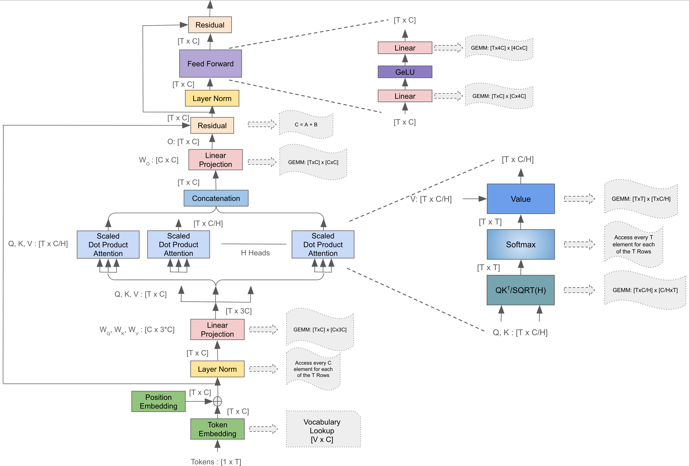
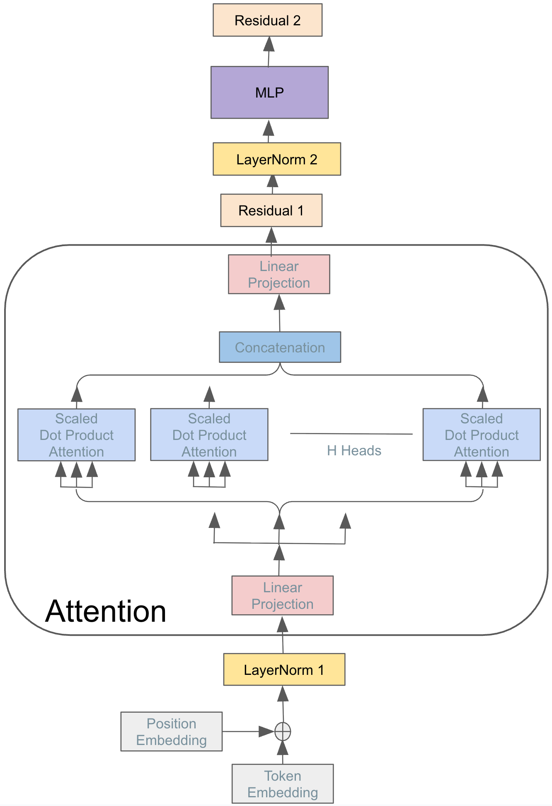

# Introduction

# The Computational Core of Modern LLMs
A prerequisite for effective performance analysis is a foundational understanding of the target software's core working mechanisms. To establish a solid baseline for our performance expectations, this section will detail the internal workings of the GPT-2 architecture as implemented in our two C++ codebases: the Eigen-Optimized Kernel [LLM-Eigen](https://github.com/zhangpiu/llm.cpp.git) and the CCCL-Accelerated Engine [LLM-CCCL](https://github.com/gevtushenko/llm.c.git) both originated from legendary Andrej Karpathy’s [llm.c](https://github.com/karpathy/llm.c.git). We will illustrate how architectural and implementation choices shape the runtime behavior and performance characteristics of transformer-based models. This foundational understanding will help establish clear performance expectations and guide the deeper profiling and analysis discussed in later sections. Readers already familiar with GPT-2 internals and model execution pipelines may choose to skim this section and proceed directly to the detailed performance investigation.
To begin, let’s focus on the training forward pass while ignoring batching for simplicity, as depicted in the first layer of the GPT-2 architecture diagram.


The model begins by converting the raw input text into a format suitable for computation, by breaking down into discrete tokens. These tokens are then mapped to continuous, high-dimensional vectors known as embeddings. This process, often handled via a lookup table, transforms sparse token IDs into dense, meaningful input vectors. The final input vector that enters the main transformer block combines these token embeddings with positional encodings. For both implementations, LLM-Eigen and LLM-CCCL, the main entry point is the **train_gpt2.cu** file. The training loop orchestrates the overall training process. In each iteration of this loop, a training sample and its corresponding target are loaded from the dataset, after which the forward pass of the model is executed. This forward pass forms the computational backbone of the training process, where most of the profiling and performance analysis will be focused in subsequent sections.

The code begins by allocating memory for activations, the intermediate tensors produced during forward and backward passes. The two implementations differ significantly in how they handle these allocations. The LLM-CCCL version allocates all activations in a single contiguous memory block, which reduces fragmentation and allows for efficient GPU memory access and management. In contrast, the LLM-Eigen implementation uses lazy allocation through the Eigen library’s LazyAllocate mechanism, which allocates memory on demand as tensors are created. While lazy allocation provides greater flexibility when working with varying tensor shapes and sizes, for example, during inference with dynamic sequence lengths, it may not yield the most optimized implementation for fixed-size training, where a bulk contiguous buffer is typically more efficient.

The training cycle begins with the entry into the Model's Forward Function. As illustrated in the architecture diagram , the initial processing steps are consistent: the input sequence is first tokenized, and the resulting token embeddings are summed with the positional encodings. This resultant vector, forms the initial input vector for the first transformer layer. The model then iterates through all transformer layers in sequence. Except for the first layer, the output of the preceding layer serves as the input to the next layer in the sequence.

A subtle but important difference lies in how the core operations within each transformer layer are structured and executed. In the LLM-Eigen version, each layer is encapsulated as a C++ class, with its constituent blocks implemented as member functions or objects of that class. In contrast, the CCCL version utilizes a flat, procedural execution of the blocks in every layer. Another key distinction lies in the implementation of sub-blocks within each transformer layer. The LLM-Eigen version adopts a mathematical operation-by-operation approach. Each core step of the calculation is mapped directly to an Eigen operation which, in turn, results in multiple, distinct kernel launches on the device. The LLM-CCCL codebase employs a more traditional high-performance strategy, where a single, fused kernel performs the entire computation of a sub-block. All these implementation choices have a direct impact on performance, and their effects will be analyzed in detail in the performance profiling section later in this blog.

The table below highlights the specific code sections corresponding to each implementation choice in both versions, providing an easy reference for readers to correlate source code with the architectural flow shown in the accompanying figure. Together, the table and figure serve as a practical guide to understanding how a modern LLM is structured and executed at a low level.

This reference will also be valuable in the next section, where we develop the roofline performance model for each of these blocks to quantify and compare their computational efficiency and memory behavior.

| Sub Blocks | LLM-Eigen | LLM-CCCL |
|------------|-----------|----------|
|Model Forward Function|ForwardGPU @ gpt.hpp|gpt2_forward @ train_gpt2.cu|
|Token Embedding & Positional Embedding|__Forward @ gpt.hpp|encoder_forward @ train_gpt2.cu|
|LLM Layer|Block::Forward @ gpt.hpp|encoder_forward @ train_gpt2.cu|
|LayerNorm|nn::LayerNorm::Forward @ nn.hpp|layernorm_forward @ train_gpt2.cu(layernorm_forward_kernel3)|
|QKV Linear Projection|CausalSelfAttention::Forward @ gpt.hpp(c_attn_->Forward)|matmul_forward_cublaslt @ train_gpt2.cu(cublasLtMatmul)|
|Self Attention: $QK^T$|nn::MatMul::Forward @ gpt.hpp|attention_forward @ train_gpt2.cu(cublasSgemmStridedBatched)|
|Self Attention: Softmax|nn::Softmax::Forward @ gpt.hpp|softmax_forward_kernel5 @ train_gpt2.cu|
|Self Attention: Value Matmul|nn::Softmax::Forward @ gpt.hpp|attention_forward @ train_gpt2.cu(cublasSgemmStridedBatched)|
|O Linear Projection|nn::MatMul::Forward @ gpt.hpp|matmul_forward_cublaslt @ train_gpt2.cu(cublasLtMatmul)|
|Residual|nn::Residual::Forward @ gpt.hpp|residual_forward @ train_gpt2.cu|
|FeedForward: MLP1 & MLP2|MLP::Forward @ gpt.hpp nn::Linear::Forward|matmul_forward_cublaslt @ train_gpt2.cu(cublasLtMatmul)|
|FeedForward: GeLU|nn::NewGELU::Forward @ gpt.hpp|gelu_forward @ train_gpt2.cu|

# Basics of GPU

# CUPTI

CUPTI is a set of API that enables developers to both retrieve hardware counters from NVidia GPUs and trace the host-side activities on CUDA. It serves as the foundation of NSight Compute, the official GPU profiler provided by NVidia. With CUPTI, independent developers can develop customized profilers that leverage the same sets of metrics and derive their own specialized insights through custom data processing

In the big picture, CUPTI has two key functionalities:

* Tracing: collecting host-side activities, like kernel launches and memset, etc.  
* Profiling: collecting hardware counters and other derived metrics like throughput.

It can also be divided into multiple sets by the way it collects data, including

* the Activity API,  
* the Callback API,  
* the Host Profiling API,  
* the Range Profiling API,  
* the PC Sampling API,  
* the SASS Metric API,  
* the PM Sampling API,  
* the Checkpoint API,  
* the Profiling API,

For this detailed analysis, we utilized our custom tool: the **GPU Memory Profiler (GMPProfiler)** . This profiler was built atop the CUPTI’s stack, leveraging both the Activities API and the Range Profiling API for fine-grained tracing and performance data collection. For the purposes of this blog, we will focus exclusively on interpreting the performance data collected.
If you’d like to explore or reproduce the tooling, we have put down the following resources:
* Source Code: [github](https://ml-memory-profiling-group.github.io/blog_v2/note/intro-to-llm/)
* Tutorial: [github](https://ml-memory-profiling-group.github.io/blog_v2/note/intro-to-llm/)

To profile the specific computational blocks we are interested in, such as a single GEMM operation or a complete sub-block the GMPProfiler utilizes a range-based profiling methodology. It lets you mark logical ranges by wrapping code with push/pop calls. Here is a sample code snippet illustrating how we wrapped and timed a specific range:

```cpp
  GmpProfiler::getInstance()->pushRange("MLP", GmpProfileType::CONCURRENT_KERNEL);
  GMP_TIMED("MLP", mlp_->Forward(ln2_y_2d_const, mlp_y_2d));
  GmpProfiler::getInstance()->popRange("MLP", GmpProfileType::CONCURRENT_KERNEL);
```
To avoid profiling overhead during normal runs, we provide both a compile-time flag and a runtime switch to enable/disable the profiler. When statically disabled, the application executes with no CUPTI overhead. We also expose a lightweight timing macro, GMP_TIMED, which uses C++ std::chrono to measure wall-clock time for any wrapped code region. This offers a quick way to gauge performance for a given range without invoking CUPTI. We will compare this basic wall-clock measurement with the more detailed, hardware-recorded time retrieved by CUPTI to gain insights into system-level overheads that affect overall performance.

We partitioned a transformer layer into performance-regions, as illustrated in the figure. Although our primary focus is on the two dominant, compute-heavy sections—Attention and MLP, we intentionally retained the non-compute intensive blocks. It would be interesting to understand how much they contribute to overall performance, but, as we will see, they offer interesting insights during profiling and performance analysis.

{: width="50%" }

# Performance Analysis
For our performance analysis, we will use the default, out-of-the-box parameters provided in the LLM repositories.
* Vocabulary Size ($V$): 50304 (padded)
* Number of Layers ($L$): 12
* Sequence Length ($T$): 64
* Hidden Size ($C$): 768
* Number of Attention Heads ($H$): 12
* Batch Size ($B$): 4

## Roofline Performance
Understanding a system’s performance in isolation is challenging; it’s far more meaningful to compare against an established baseline or rigorous theoretical limits. For our analysis, we will use the Roofline Model. Its a powerful analytical framework that defines the maximum achievable performance of a given application on a specific hardware system. It works by first determining two key application characteristics: the required computational intensity (FLOPs) and the necessary memory transfers. For a given application and hardware, relates arithmetic intensity (FLOPs per byte moved) to the machine’s peak compute and peak memory bandwidth. It tells you whether a kernel is compute-bound or memory-bound, and sets a clear ceiling on the performance you can expect on that system. For a concise introduction, see the NERSC guide to the [roofline model](https://docs.nersc.gov/tools/performance/roofline/). Further references will be provided at the end of this post.

As we construct the roofline model for each sub-block in a GPT-2 layer, the first step is to quantify memory traffic. The table below enumerates the activation tensors (shapes and data types) produced and consumed by each sub-block;
| SUB BLOCKS | NUM ELEMENTS | TOTAL SIZE (MB)|
|------------|--------------|----------------|
|Input | $B * T * C$ | 0.75 |
|Layer Norm | $B * L * T * C$ | 2.25 |
|Q, K, V | $B * L * T * 3C$ | 6.75 |
|SoftMAX($QK^T$) | $B * L * H * T^2$ | 2.25 |
|O | $B * L * T * C$ | 2.25 |
|Residual | $B * L * T * C$ | 2.25 |
|MLP1 | $B * L * T * 4C$ | 9 |
|MLP GeLU | $B * L * T * 4C$ | 9 |
|MLP2 | $B * L * T * C$ | 2.25 |

Refer to the table below for a breakdown of the computations performed by each sub-block—including key operations and FLOP counts.
| SUB BLOCKS | Operations | Total OPs|
|------------|------------|----------|
|LayerNorm | Element Wise - {Mean: 1x ADD} {RSTD: 1x SQRT, 1x ADD} {Norm & Scale: 1x ADD, 1x SUB, 2x MUL} | $7 * B * T * C$|
|Q, K, V | Dense GEMM: (BT x C) x (C x 3C) | $6 * B * T * C^2$|
|$QK^T$ | Batch & Head Wise - Dense GEMM: (T x C/H) x (C/H x T)| $2 * B * T^2 * C$|
|SoftMAX |Element Wise - {1x EXP, 1x ADD, 1x DIV}| $3 * B * H * T^2$|
|V Matmul | Dense GEMM: (T x T) x (T x C/H)| $2 * B * T^2 * C$|
|O | Dense GEMM: (BT x C) x (C x C) | $2 * B * T * C^2$|
|Residual | Element Wise - {1x ADD}| $B * T * C$|
|MLP1 | Dense GEMM: (BT x C) x (C x 4C)| $8 * B * T * C^2$|
|MLP2 | Dense GEMM: (BT x 4C) x (4C x C)| $8 * B * T * C^2$|

Using these two tables, we compute the arithmetic intensity (AI) for each sub-block, classify each as compute-bound or memory-bound, and then derive its roofline performance ceiling accordingly. The table below walks through these steps and reports the resulting roofline limits for all sub-blocks.
|SUB BLOCKS | AI | Bound | Execution Time (us)|
|-----------|----|-------|--------------------|
|LayerNorm | < 1 | Memory | |
|Q, K, V | > 80 | Compute | |
|$QK^T$ | > 40 | Compute | |
|SoftMAX | < 1 | Memory | |
|V Matmul | > 40 | Compute | |
|O | > 300 | Compute | |
|Residual | < 0.1 | Memory | |
|MLP1 | > 300 | Compute | |
|MLP2 | > 300 | Compute | |

With our definitive Roofline Performance figures now established, we transition from theoretical limits to real-world measurement. We will examine the actual performance attained by both the LLM implemntations compare it against these theoretical ceilings to understand how closely each implementation approaches its roofline—and where performance gaps emerge.

## Kernel Invocations
The kernel launch is the mechanism by which CUDA assigns computation tasks to the GPU's Streaming Multiprocessors (SMs) with a specified grid–block–thread configuration. Kernel launches introduce inherent overhead, and choices of grid/block sizes has profound impact on system performance, can either underutilize the GPU or add excess launch/scheduling overhead. This nuanced decision-making process is a craft—balancing occupancy, memory access patterns, and launch counts. Exactly why good GPU programmers are valued, and (yes) paid handsomely in today's AI industry and this blog will take you a step in that direction. Alright, enough of the sales pitch, back to the performance that matters. For readers interested in the intricate details, NVIDIA’s GTC talks and CUDA performance guides walk through the trade-offs. 
The table below provides a direct comparison of the kernel launch behavior of the two implementations. Note that LLM-Eigen relies on Eigen as its backend, which translates high-level tensor operations into multiple kernel launches, whereas LLM-CCCL directly invokes CUDA kernels for each sub-block.
|PERF-REGIONS|LLM-Eigen|LLM-CCCL|
|----------|---------|--------|
|LayerNorm 1|2|1|
|Attention|440|8|
|Residual 1|1|1|
|LayerNorm 2|3|1|
|MLP|5|4|
|Residual 2|1|1|

Comparing the forward pass implementations reveals a stark difference in kernel launch philosophy. It is immediately apparent that the LLM-Eigen version launches a significantly higher number of kernels, particularly within the Attention block. This discrepancy arises because the LLM-Eigen version relies on the Eigen backend, where mathematical operations are translated into a sequence of non-explicit kernel launches. In other words, the number of resulting kernels and their launch configurations (grid/block sizes) are highly dependent on Eigen's internal implementation and are not guaranteed to correspond to a single assignment. In contrast, LLM-CCCL fuses the sub-block’s work into one global kernel per major range utilizing few helper kernels as needed. Lets dig deeper into its implementation of Attention to explain the large discrepency.

LLM-Eigen version's enormous 440 kernel launches in the attention stems from the factor that how the code is structured. It relies on nested loops (over sequence, heads) combined with fine-grained tensor operations. When coupled with per statement wise kernel launch the overall kernel count just blows up. In contrast, the LLM-CCCL expresses Attention using a single basic block of code that intelligently calls cuBLAS Batched GEMM to aggregate work across batches/heads into larger batched operations. The distinction, therefore, lies in fundamental design philosophy: the Eigen approach favors simplicity of expression (using standard C++ loops and libraries), whereas the CCCL approach favors maximum hardware utilization. With a batch size ($B$) of 4 and 12 attention heads ($H$), this design choice introduces a 48x iteration difference that significantly amplifies the total number of kernel launches as observed.

Below is the code snippet illustrating how the attention module is structured for both the versions:

```cpp
// LLM-Eigen Attention Implementation
for (int b = 0; b < B; ++b)  
{  
    for (int h = 0; h < NH; ++h)  
    {  
        // Calculate QK^T
        nn::MatMul::Forward(q2d, k2d, preatt2d, factor);

        // softmax
        nn::Softmax::Forward(preatt2d_tensor, preatt_softmax2d_tensor);

        // att * V
        nn::MatMul::Forward(preatt_softmax2d, v2d_const, att2d);
    }  
}

// LLM-CCCL Attention Implementation

// Calculate QK^T
cublasCheck(cublasSgemmStridedBatched(cublas_handle, CUBLAS_OP_T, CUBLAS_OP_N, T, T, HS, &alpha, k, HS, T * HS, q, HS, T * HS, &beta, preatt, T, T * T, B * NH));

// softmax
softmax_forward_kernel5<<<grid_size, softmax_block_size>>>(att, scale, preatt, B * NH, T);

// att * V
cublasCheck(cublasSgemmStridedBatched(cublas_handle, CUBLAS_OP_N, CUBLAS_OP_N, HS, T, T, &alpha, v, HS, T * HS, att, T, T * T, &beta, vaccum, HS, T * HS, B * NH));

```

<center>Grid and Block Statistics</center>

|  | Eigen | CCCL |
| :---- | :---- | :---- |
| min block | 1 | 16 |
| max block | 3144 | 1536 |
| mean block | 3 | 159 |
| median block | 4 | 320 |
| avg warp/block | 24 | 8 |

Another key aspect to understand when analyzing GPU kernels is the grid size and block size. We've included the statistics for all implementations. The results clearly show the Eigen implementation tends to launch most kernels with only a handful of blocks (often single-digit), while the CCCL version consistently launches around 160 blocks on average. This difference has major implications for GPU utilization. The Eigen llm.cpp kernels are, in effect, severely underutilizing the GPU's compute resources. Our tests were conducted on an NVIDIA A100, which features 108 streaming multiprocessors (SMs). Ignoring stalls from data dependencies and assuming a single active CUDA stream, we can reason that since a block cannot span across multiple SMs, we need at least 108 blocks to fully occupy all SMs—one block per SM. Our estimation of SM utilization is:

$$SmUtilization = \frac{\max(DeviceSmNum, BlockSize)}{DeviceSmNum} \times 100\%$$

This formula is based on the assumption of single device and no parallel kernel execution. The Eigen llm.cpp forward kernels only launch about 2.7 blocks per launch on average, which means that roughly 2% of the SMs are actually being used—an astonishingly low figure for such a powerful GPU. It’s worth noting that we assume the scheduler assigns blocks to idle SMs first, rather than sharing SMs among active blocks, since this policy maximizes utilization. NVIDIA’s exact block scheduling policy isn’t publicly documented, so this conclusion is based on empirical observation and reasonable inference. Regardless of the precise scheduling details, the number of blocks required for full utilization must be at least 108, so our conclusion about underutilization remains valid.

## Wall Clock Time and GPU execution Time

Time consumption is one of the key metrics of any type of program. In this blog we will focus on the wall clock time and the GPU time of the two implementations.

* The GPU execution time is the time GPU takes to finish all the calculation. It is collected from hardware counters per kernel through CUPTI. For a range, we add the gpu\_\_time\_duration.max of all the kernels within it.
* The wall clock time is the time from the start to the end of executing a piece of code on the CPU. We use C++ std::chrono::high\_resolution\_clock::now() to wrap the code snippet and get the duration through subtracting the two timestamps. This time is measured on the CPU side, so it will include all the time spent by the code wrapped, including GPU execution time, launch overhead, any housekeeping operations like makespan, makeMatrix, synchronized cuda memory copy/memset, etc.

Note that by default the kernel launch is asynchronous and launching a kernel will only push it into a queue but not execute it. With CUPTI range profiling enabled, all kernels will be executed synchronously. That’s why our wall clock time includes the GPU execution time.

Below are the wall clock time(in microseconds) and GPU time(in nanoseconds) of all the ranges and their ratio. A huge overall performance gap between Eigen and CCCL implementation are presented and many factors contribute to these gaps.

![][forward-gpu-time]![][forward-gpu-time-ratio] 

Let's start from the GPU time. Without considering CPU side, the gap between the two versions is still enormous. The biggest contributors to the GPU time are the attention and mlp ranges, which is as expected because according to the roofline calculation, these two ranges did most FLOPs and MOPs. However, if we compare the ratio of GPU time between the two versions, we can observe that the attention range of the Eigen llm.cpp significantly outweighs the mlp range, whereas in CCCL llm.cpp, these ranges are relatively equivalent. According to the prior section, we know that huge amounts of small kernels are launched within the attention of Eigen llm.cpp. This causes several problems:
* Reduced locality on L1 because L1 is flushed between kernels.
* Poor latency hiding due to the shortage of blocks and short kernels.
* Low SM utilization because of the lack of blocks to be assigned to SMs.

Another noteworthy point is the developer of the CCCL llm.cpp implementation applied several optimizations to improve cache efficiency — for instance, using cache streaming to allow one-time data to bypass the cache, and employing reverse iteration to increase cache hits at the tail of arrays. In contrast, the Eigen version lacks such low-level optimizations, at least from the user side. As a result, the CCCL version achieves higher cache hit rates and fewer dram accesses, which directly contributes to its shorter execution time.

![][forward-wallclock-time]![][forward-wallclock-time-ratio]

On the other side, the gap of the wall clock time enlarges, suggesting that there are more factors outside GPU that further drops down the overall performance. We suggest that the additional dropdown is probably dorminated by launch overhead. To explain the difference, we conducted an experiment using a simple helloworld CUDA program. In this program, we launched 440 kernels with minimum FLOPS and MFLOPS and the average wall clock time we got is 12.4 microseconds per kernel, which should mostly be launch overhead. In comparison, we calculated the average gaps between kernels to estimate the launch overheads of the two llm.cpp using this formula:

$$AvgLaunchOverhead = \frac{RangeWallClockTime - GpuExecutionTime}{KernelNum}$$

The result is presented here:

<center>Average Gap Between Wall Clock Time And GPU Time</center>

| Layer         | Eigen Avg Gap (µs) | CCCL Avg Gap (µs) |
|----------------|--------------------------------|--------------------------------|
| ln1            | 5.136                          | 14.544                         |
| attention      | 6.669                          | 5.053                          |
| residual1      | 14.288                         | 13.128                         |
| ln2            | 3.747                          | 14.064                         |
| feed_forward   | 90.354                         | 9.172                          |
| residual2      | 15.064                         | 13.840                         |

We can see that the avg gap mostly lies between 3~15µs, which matches the maginitude of approximate launch overheads from helloworld. This indicates that the extra wall clock time of the two llm.cpp is mostly launch overheads. Other than this, there are other minor possibilities that can contribute to the wall clock time:
* Allocation and release of resources, e.g. registers and shared memory, especially for the attention of Eigen.
* Synchronized Host-to-Device or Device-to-Host memory transfer or memset. 
* Execution time of CPU instructions.
* Overheads for library to choose appropriate kernels.

## SASS Instructions

SASS (Streaming Assembler) is the low-level assembly language executed by NVIDIA GPUs. It’s the final compiled form of CUDA kernels. CUPTI allows us to collect all kinds of SASS, but in this blog, we will focus on the global load/store instructions and the bytes it reads/writes. Here is the sample SASS instruction data of the residual range:

| metrics | Eigen | CCCL |
| :---- | :---- | :---- |
| smsp\_\_sass\_data\_bytes\_mem\_global\_op\_ld.sum | 1572864 | 1572864 |
| smsp\_\_sass\_data\_bytes\_mem\_global\_op\_st.sum | 786432 | 786432 |
| smsp\_\_sass\_inst\_executed\_op\_global\_ld.sum | 3072 | 12288 |
| smsp\_\_sass\_inst\_executed\_op\_global\_st.sum | 1536 | 6144 |

* smsp\_\_sass\_data\_bytes\_mem\_global\_op\_ld.sum is the total number of global load **warp** instructions issued. Note that this doesn’t include atomic or shared loads,which are collected in other metrics. 
* smsp\_\_sass\_data\_bytes\_mem\_global\_op\_ld.sum represents the actual data loaded by the SASS instructions. 

Store instructions are similar to the load instructions. We choose residual as an example because it is relatively straightforward and only contains an element-wise add operation. The GPU should load two input matrices and store the output matrix. That’s why there are 2x load instructions and bytes compared to stores. You may also notice that even though both implementations load/store the same amount of data, the Eigen version executed only ¼ instructions of the CCCL version. This is because the Eigen version employs vectorized loads for contiguous elements so that each global load will load 4 floats instead of 1 float. We can calculate it through following this formula:

$$AvgFloatsLoadedPerThread = \frac{SassBytesLoaded}{LoadSassInstIssued \times 32 \times 4}$$

We divide 32 because the issued SASS instructions are counted in warps. The 4 comes from 4 bytes per float. The result of the Eigen version is 4 floats per load. For the CCCL version, this number is reduced to 1 float per load. The vectorization is one optimization Eigen implicitly does for loads and stores automatically, which can reduce redundant instructions and issue overheads.

## L1, L2 and dram accesses

When SASS loads and stores are executed in the thread, they will be coalesced with other instructions executed by other threads within the warp and sent to L1. If the request missed,L1 will forward the request to L2. If it still misses, L2 will send requests to the dram in sectors. Here are the metrics we are interested and we will still show the residual range as an example:  

* l1tex\_\_t\_requests\_pipe\_lsu\_mem\_global\_op\_ld.sum: approximately the global load requests L1 cache received from the warps. The “lsu” implies that the requests are from the load store unit. The “approximately” means there might be requests other than global loads, like LDSTS instructions, but this is not so important and is beyond the scope of this blog. In most cases, you can find that it ballparkly matches the number of SASS load requests.  
* l1tex\_\_t\_sectors\_pipe\_lsu\_mem\_global\_op\_ld.sum is the number of sectors accessed by the requests received by L1 cache. In general this metric should be greater or equal to smsp\_\_sass\_data\_bytes\_mem\_global\_op\_ld.sum/32. Since the warps access contiguous and 32-aligned addresses in residual range, it exactly matches that result.   
* lts\_\_t\_requests\_srcunit\_tex\_op\_read.sum: the requests L2 cache received from L1.  
* lts\_\_t\_sectors\_srcunit\_tex\_op\_read.sum: the sectors accessed by the L2 requests from L1. Each request can contain 1\~4 sectors. This metric also represents how many sectors L1 missed.  
* dram\_\_sectors\_read.sum: sectors requested from L2 because of L2 misses.Note that though dram sends the data in bursts, the unit of these metrics is 32 byte sectors, so these metrics should be the actual bytes loaded divided by 32\.

![][residual-accesses]

In general, from L1 to L2 to dram, the sector metrics should gradually reduce. The higher the hit rates, the more they reduce. Here we can see L1 sector loads and L2 sector loads are the same. This is because all the addresses in residual will only be accessed once, so the hit rate is 0%. All the sectors being accessed in L1 are forwarded to L2.  Previously we mentioned that the Eigen llm.cpp is utilizing vectorized load, and that’s why the L1 requests of Eigen are relatively low compared to the CCCL version. There are also different dram sector reads between two implementations. This is probably because of L2 partitions or the activations that remain in L2 since L2 will not be flushed between kernel launches.

## Dram throughput

Finally, after requests have been filtered through L1 and L2, they reach dram, whose bandwidth greatly affects the overall performance of the system. CUPTI provides dram\_\_throughput.avg.pct\_of\_peak\_sustained\_elapsed, a percentage showing how much of theoretical sustained peak throughput one kernel can use, but this metrics only measures per kernel throughput. If we calculate the average throughput through adding all the metrics in range and divide by number of kernels in range, in some extreme cases, it may show misleading throughput because it loses the information of time. For example, if we have 1 kernel that heavily utilizes 100% throughput for an hour and 99 kernels use 0% in just 1 second, we will get an average usage of 1%, which looks pretty off. Therefore, instead of directly averaging the throughput metrics provided by CUPTI, we calculate the overall throughput by doing

$$DramThroughput = \frac{(DramReadSectors + DramWriteSectors) \times 32}{GpuTime}$$

Here is the data we produced:

![][dram-throughput]  

From the chart, we can find that generally the CCCL version consumes more dram throughput than the Eigen one. Previously we talked about the low grid size of the Eigen version. The low SM utilization will lead to slow issue rate of load and store instructions, causing low throughput. Remember the average grid size for Eigen implementation is 3. This makes most of the SM inactive, not being able to commands and leave the remaining throughput wasted. 

Another reason might be  the GPU time of the range. If we refer back to the prior section, we can find that the CCCL version takes less than 1/10 GPU time of the Eigen ones. Our equation of the throughput indicates that the denominator is the GPU time. With the same amount of dram loads and stores, the bandwidth will be multiple times higher if the time is as short as that. The reduced time of the CCCL llm.cpp indicates a better usage of dram bandwidth over leaving the bandwidth wasted for a long period of time.

Finally, the layer norms barely accessed the dram in both implementations. This is expected because the calculation of the norms doesn't involve any parameters. All it needs is to load the previous activations and store the result norm. As L2 will not be flushed across kernels, the activation produced by the previous range should still reside in the L2. Therefore even if there will be SASS  loads and L1 requests, these accesses will be filtered out by L2 and keep the dram intact. That's another reason to explain layer norms use such a little throughput in both implementations other than the grid size.  

[kernel-num]: <kernel-num.png>
[forward-wallclock-time]: <forward-wallclock-time.png>
[forward-wallclock-time-ratio]: <forward-wallclock-time-ratio.png>
[kernel-num-ratio]: <kernel-num-ratio.png>
[forward-gpu-time]: <forward-gpu-time.png>
[forward-gpu-time-ratio]: <forward-gpu-time-ratio.png>
[residual-accesses]: <residual-accesses.png>
[dram-throughput]: <dram-throughput.png>
