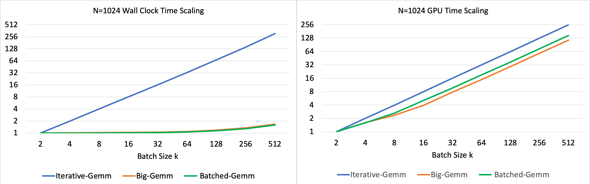
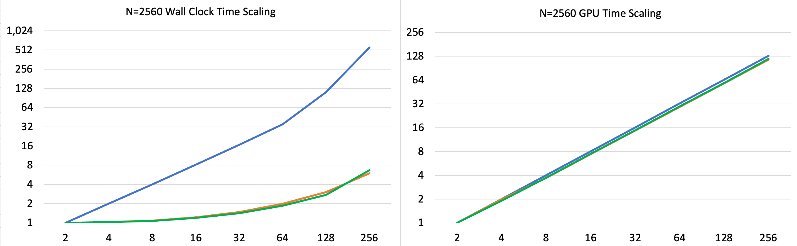
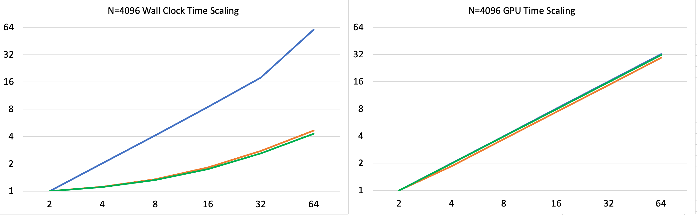
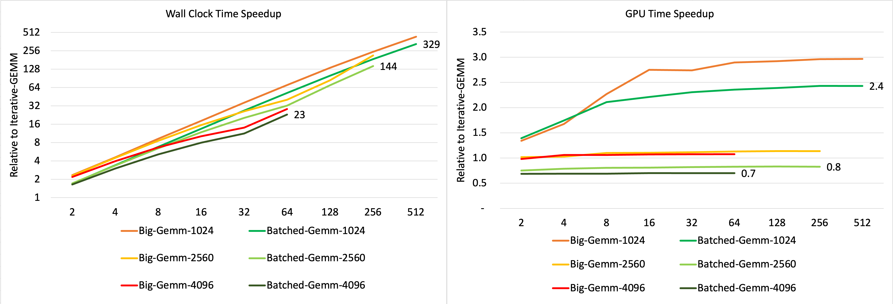
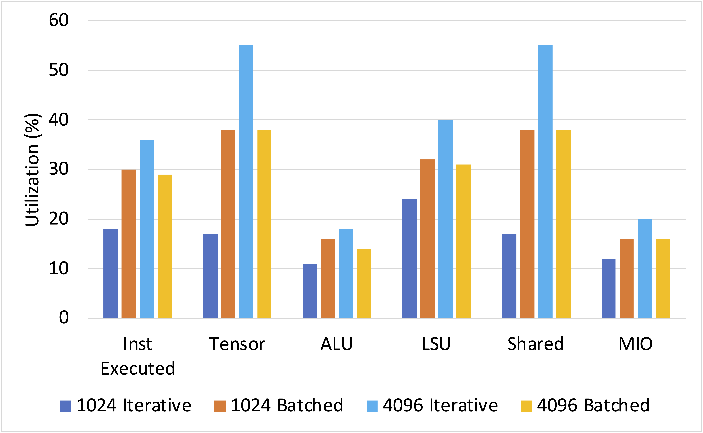
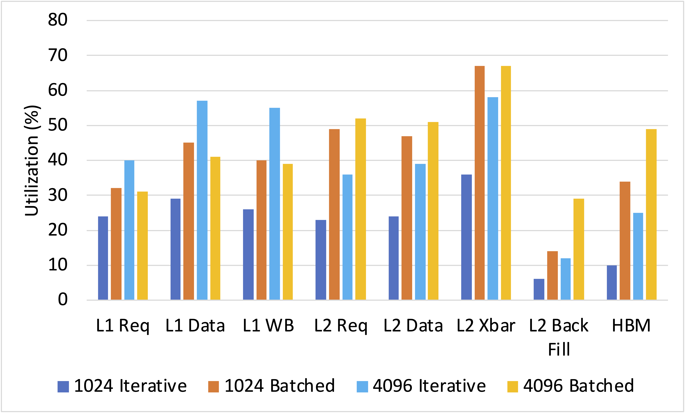
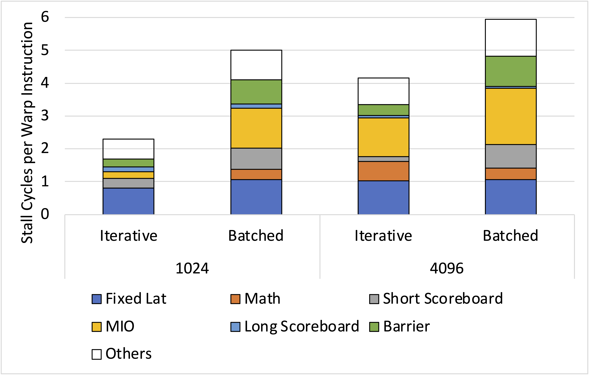

# Introduction
Attention layer is among the most time-consuming part of any LLM. It consists of multiple matrix multiplications that are theoretically bottlenecked by tensor core throughput according to the roofline model from this post[link]. However, our transformer scaling analysis shows that the attention block’s matrix multiplications do not scale uniformly: performance shifts with shape, batching, and layout in ways that materially change where the bottleneck exists. This discrepancy between theory and reality leads to this post. We analyze a few representative cuBLAS GEMM kernels on a single NVIDIA GPU. Additionally, to ensure our assessment remains grounded in modern workloads, we utilize matrix dimensions derived from the Llama 3.1 architecture spanning both training and inference scenarios.

GEMM(i.e. General Matrix Multiplication) is always one of the hottest topic in HPC. The transformer architecture made this even more stark: every attention layer, every feed-forward block, every projection is fundamentally a GEMM, therefore even small amount of improvement on GEMM can cause huge impact on overall system performance. You can refer to our earlier [blog](https://ml-memory-profiling-group.github.io/blog_v2/note/intro-to-llm/) for a quick refresher on transformer operations. In a standard multi-head self-attention (MHA) block, the heavy compute is essentially two matrix multiplications per head:
* $$\text{Attention Scores}: Q \times K^T ==> [S \times D/H] \times [D/H \times S] = [S \times S]$$
* $$\text{Value Attention}: Softmax(Q \times K^T) \times V ==> [S \times S] \times [S \times D/H] = [S \times D/H]$$

where $S$ is the sequence length, $D$ is the model hidden dimension and $H$ is the number of head.

The Transformer architecture is designed such that each of the $H$ head operates in a different representation subspace and performs the above two GEMMs independently between the heads.

Given this there are two ways to implement each of the above GEMM:
* Implement iteratively using a loop over $H$, we would launch $H$ separate, smaller GEMM kernels
* One single **Batched GEMM** kernel for a batch size of $H$ : $$[H \times S \times D/H] \times [H \times D/H \times S] = [H \times S \times S]$$

For more details you can refer to NVIDIA's blog on [BatchedGemm](https://developer.nvidia.com/blog/cublas-strided-batched-matrix-multiply/) and [cuBLAS API](https://docs.nvidia.com/cuda/cublas/)

# Setup
We will profile 4 ways of computing GEMM using cuBLAS. To compare apples to apples, it is ensured that every cuBLAS GEMM perform the same amount of FLOPs with FP32 and running on the same device, which is an A100 (40GB, SXM4).

## Big-GEMM: the practical performance upper bound
Treat the entire Multi-Head Attention operation as one massive, monolithic matrix multiplication. This is simply calling *cublasSgemm* with wider matrix compared to other methods. This is expected to perform at least no worse than other metrics because:

* More opportunities to reuse the memory.
* More algorithms available for larger matrices.
* Less padding needed for tiling compared to smaller GEMMs.
* Less kernels invoked.

Therefore the single big GEMM is considered as a upper bound on Performance among all the methods.

## Iterative-GEMM: the naive decomposition
Given many small matrix multiplications, we have two ways of distributing the work to GPU: either launching one kernel for each matrix multiplications or fusing the kernels into one or several mega-kernels. IterativeGEMM continuously launches per-head matrix multiplication small kernels in a for-loop. Here is a piece of sample code: 

```cpp
for (int i = 0; i < batch_size; i++) {
    CHECK_CUBLAS(cublasSgemm(handle, CUBLAS_OP_N, CUBLAS_OP_N,
                            m, n, k_dim,
                            &alpha,
                            d_A_array[i], m,
                            d_B_array[i], k_dim,
                            &beta,
                            d_C_array[i], m));
}
```

## Batched-GEMM: the smart aggregated execution
As mentioned before, the second approach for many small matrix multiplications is batching. The Batched GEMM allows you to perform multiple independent matrix multiplications in a single or small amount of kernel launches, which are supposed to be much more efficient than launching separate GEMM operations. This is supossedly the smart choice:
* Reduced Launch Overhead
* Smart Scheduling

To batch the GEMM, we simply prepare the input matrices as array of pointers and call the corresponding CUBLASS API:

```cpp
// Allocating DEVICE matrices and store the pointers in HOST vectors
std::vector<float*> d_A_array(batch_size), d_B_array(batch_size), d_C_array(batch_size);
for (int i = 0; i < batch_size; i++) {
    if (cudaMalloc(&d_A_array[i], size_A) != cudaSuccess ||
        cudaMalloc(&d_B_array[i], size_B) != cudaSuccess ||
        cudaMalloc(&d_C_array[i], size_C) != cudaSuccess) {
        printf("CUDA malloc failed for Batched Gemm");
        for (int j = 0; j <= i; j++) {
            if (d_A_array[j]) cudaFree(d_A_array[j]);
            if (d_B_array[j]) cudaFree(d_B_array[j]);
            if (d_C_array[j]) cudaFree(d_C_array[j]);
        }
        return false;
    }
}

// Allocating DEVICE vectors to store DEVICE pointers to arrays 
float **d_A_ptr, **d_B_ptr, **d_C_ptr;
if (cudaMalloc(&d_A_ptr, batch_size * sizeof(float*)) != cudaSuccess ||
    cudaMalloc(&d_B_ptr, batch_size * sizeof(float*)) != cudaSuccess ||
    cudaMalloc(&d_C_ptr, batch_size * sizeof(float*)) != cudaSuccess) {
    printf("CUDA malloc failed for pointer arrays in testBatchedGemm - skipping test\n");
    for (int i = 0; i < batch_size; i++) {
        cudaFree(d_A_array[i]);
        cudaFree(d_B_array[i]);
        cudaFree(d_C_array[i]);
    }
    return false;
}

// Copy pointers from HOST to DEVICE
CHECK_CUDA(cudaMemcpy(d_A_ptr, d_A_array.data(), batch_size * sizeof(float*), cudaMemcpyHostToDevice));
CHECK_CUDA(cudaMemcpy(d_B_ptr, d_B_array.data(), batch_size * sizeof(float*), cudaMemcpyHostToDevice));
CHECK_CUDA(cudaMemcpy(d_C_ptr, d_C_array.data(), batch_size * sizeof(float*), cudaMemcpyHostToDevice));

CHECK_CUBLAS(cublasSgemmBatched(handle,
                                CUBLAS_OP_N, CUBLAS_OP_N,
                                m, n, k_dim,
                                &alpha,
                                (const float**)d_A_ptr, m,
                                (const float**)d_B_ptr, k_dim,
                                &beta,
                                d_C_ptr, m,
                                batch_size));
```

## Strided-Batched-GEMM: the contigous memory advantage
Similar to Batched GEMM, cuBLAS provides another way to batch small GEMMs. The essential difference of the two batched GEMM are the memory layout of the input matrices. Batched GEMM stores the matrices separately, whereas Strided Batched GEMM utilizes a contiguous piece memory to store each matrix. Instead of accepting pointer arrays to matrices, Strided Batched GEMM receives the base device pointers of matrices along with the stride, which are used to compute the address of sub-matrices.

The benefit of this method is clear: for array-of-pointer solution, it needs to first read the pointer, and then read the data from the memory. However, only one read is needed for the pointer-with-stride option because the pointer is calculated through the base pointer, batch id and stride.

Here is the sample code:
```cpp

// Pointers to matrices on the DEVICE
float *d_A, *d_B, *d_C;

// Allocate DEVICE memory
if (cudaMalloc(&d_A, total_size_A) != cudaSuccess ||
    cudaMalloc(&d_B, total_size_B) != cudaSuccess ||
    cudaMalloc(&d_C, total_size_C) != cudaSuccess) {
    printf("CUDA malloc failed in testStridedBatchedGemm - skipping test\n");
    if (d_A) cudaFree(d_A);
    if (d_B) cudaFree(d_B);
    if (d_C) cudaFree(d_C);
    return false;
}

CHECK_CUBLAS(cublasSgemmStridedBatched(handle,
                                        CUBLAS_OP_N, CUBLAS_OP_N,
                                        m, n, k_dim,
                                        &alpha,
                                        d_A, m, stride_A,
                                        d_B, k_dim, stride_B,
                                        &beta,
                                        d_C, m, stride_C,
                                        batch_size));
```
## Workload Dimension: the parameter space and scaling knob
We begin with square matrix multiplications, the simplest and most symmetric case. We perform $k$(batch size) independent multiplications of $A[N \times N] \times B[N \times N] = C[N \times N]$. To ensure fair comparison across all four methods, we configure each to perform identical total FLOPs:

| Method | Configuration | Total FLOPs | Total Memory |
|--------|---------------|-------------|--------------|
| Big-GEMM | $(N \times N) \times (N \times kN)$ | $2kN^3$ | $(2k + 1)N^2$ |
| Iterative-GEMM | $k$ iterations of $(N \times N) \times (N \times N)$ | $2kN^3$ | $3kN^2$ |
| Batched-GEMM | $k$ batched $(N \times N) \times (N \times N)$ | $2kN^3$ | $3kN^2$ |
| Strided-Batched-GEMM | $k$ batched $(N \times N) \times (N \times N)$ | $2kN^3$ | $3kN^2$ |

Across the setups above, arithmetic intensity increases with $O(N). This suggests that at larger N, the kernels may move toward the compute-bound regime. We evaluate how often and under which shapes this actually occurs.

The A100's 40 MB L2 cache plays a critical role in GEMM performance. When working sets fit in L2, data can be reused across thread blocks without expensive memory accesses. To investigate how cuBLAS adapts its strategies to these hardware limits, we selected three specific values for our scaling dimension $N$, each representing a distinct caching regime:

Caching Regime | $N$ | Memory Size($A+B+C$) | Ratio to L2 (40 MB) | Expected Behavior |
|--------------|-----|----------------------|---------------------|-------------------|
|Cache Resident   | 1024 | 12 MB | ~0.3× | Fits comfortably; high L2 hit rate |
|Tiling Transition| 2560 | 75 MB | ~1.9× | Exceeds L2; partial eviction |
|Memory Streaming | 4096 | 192 MB | ~4.8× | Far exceeds L2; streaming from memory |

For each $N$, we progressively increase $k$ from 2 up to the maximum feasible value before exhausting GPU memory, and measure how the runtime and throughput of each method scale.

# Results
We begin by examining how each implementation scales with batch size $k$ under the different cache regimes. In each figure, the x-axis is $k$ and the y-axis reports normalized runtime in log scale, where we divide each method’s runtime by its own runtime at $k=2$. By plotting both GPU Time (the duration the kernels actually spend on the hardware) and Wall Clock Time (the total time from the CPU’s perspective), we can precisely decouple kernel efficiency from system-level overhead.



In the cache-resident regime (N = 1024), Iterative-GEMM shows an almost perfectly linear increase in GPU time as $k$ grows. In contrast, both Big-GEMM and Batched-GEMM scale sub-linearly, indicating that with a larger effective workload they can utilize GPU resources more efficiently (better scheduling/occupancy and improved overlap of latency..). The wall-clock results make the overhead tax clear. Iterative-GEMM is severely penalized by kernel-launch overheads: increasing $k$ by 256x leads to roughly a 300x increase in wall-clock time. In staggering contrast, for the same 256x increase in $k$, both BigGemm and Batched-Gemm see their Wall Clock time increase by only 1.6x. This result proves that for small matrix dimensions, Kernel Launch Amortization is the most important optimization followed by otimizing for GPU resources. By collapsing many launches into one, Batched-GEMM recovers nearly all the performance overhead, coming within 75-80% that of Big-GEMM. 




As we move from the L2-resident regime to larger matrix dimensions, the computational weight of each individual GEMM increases. The GPU time curves for all three implementations track each other closely and scale almost linearly with $k$, suggesting similar device-side efficiency once the matrices no longer sit comfortably in L2. However, kernel-launch overhead remains the dominant tax for the iterative implementation. For example, in the Memory Streaming regime (N = 4096), increasing k by 32x leads to roughly a 60x increase in wall-clock time for Iterative-GEMM, compared to about 4.5x for Big-Gemm and Batched-GEMM.



But the key question is how efficient Batched-GEMM actually is in practice. To answer this, the charts above plot the relative performance of BigGemm and Batched-GEMM against the Iterative-GEMM baseline for every value of k we tested.

When we look strictly at GPU Execution Time, the results reveal a fascinating divergence based on the matrix dimensions ($N$). Batched-GEMM is clearly beneficial in the cache-resident regime. When the batch is known upfront, cuBLAS can schedule the work more effectively and achieve higher realized FLOP throughput. Even at a tiny batch size of $k=2$, the batched version is 1.4x faster. This advantage plateaus at approximately 2.4x from $k=64$ onwards, representing the point where the GPU reaches maximum occupancy. Surprisingly, in the larger regimes, batching actually lowers GPU performance by 20–30% compared to performing every GEMM individually. While this seems counter-intuitive, it suggests that the internal heuristics used by the batched cuBLAS kernels likely optimized for general-purpose batching are slightly less efficient than the specialized single GEMM kernels when the matrices are large enough to saturate the GPU on their own. We will investigate the architectural reasons for this behavior later in this post.

The wall-clock results tell a different and more consistent story. Regardless of regime, avoiding a per-head launch loop dominates end-to-end performance. Compared to Iterative-GEMM, batched execution delivers speedups that start around 1.6x and grow dramatically with $k$, reaching approximately 330x, 150x, and 20x in the three regimes at the largest batch sizes. This reflects the fact that Iterative-GEMM increasingly pays for kernel-launch and synchronization overhead as $k$ grows, while Batched-GEMM and Big-GEMM amortize that cost over much more work per call.

* Takeaway: The data confirms that even if a batched kernel is slightly less efficient at the hardware level for large matrices, the system-level gain from eliminating sequential launch overhead is so immense that it is virtually always the superior choice.

## Deep dive: Under the hood exploration
*Caution: This section explores the intricate micro-architectural reasons behind GPU-side performance shifts. Assumes some familarity with GPU micro-architecture. Feel free to skip to the next section: Measuring Performance on Practical LLM Sizes.*

As we observed, Batched-GEMM is significantly faster than the Iterative version on the GPU for $N=1024$, yet it actually becomes 20-30% slower at $N=4096$. This "performance reversal" is driven by how the cuBLAS library manages hardware resources and schedules work across the GPU's Streaming Multiprocessors (SMs). We investigate this behavior by comapring the two regimes using a fixed batch size of $k = 16$. The tables below specfies the launch configuration for the kernels.

|Regime | Iterative | Batched |
|-------|-----------|---------|
|N = 1024 | (128, 1, 1) x (128, 1, 1) | (64, 1, 16) x (128, 1, 1) |
|N = 4096 | (256, 2, 1) x (256, 1, 1) | (512, 2, 16) x (128, 1, 1) |

A key consideration in CUDA performance is the available parallelism. In particular, the per-SM limits on resident thread blocks and warps determine how many blocks an SM can keep in flight, and therefore how many active warps the scheduler has available to hide latency and keep execution resources busy (Occupancy in CUDA parlence). With that in mind, we inspected the occupancy-related limits and found that:
* Iterative cuBLAS Kernels - Each SM can hold just 1 block limited by the shared memory used by the block
* Batched cuBLAS Kernels - Each SM can hold at most 2 blocks limited by both the register and shared memory usage

This factor significantly hurts the iterative implementation at N = 1024: each SM ends up with only 4 active warps (32 x 4 = 128) and on an architecture like the A100, 4 active warps is dangerously low. It provides the scheduler with very little slack to hide instruction latencies or pipeline bubbles. In contrast, the other kernels sustain 8 active warps per SM, improving occupancy and giving the scheduler enough parallelism to better hide latency and keep the GPU busy as the data further reveals this aspect.


First, looking at the achieved compute throughput and memory-hierarchy bandwidth across the kernels, we see that the Iterative version at N = 1024 delivers the lowest utilization of both compute and memory resources, consistent with the limited active warps discussed above. The most striking shift occurs when we increase the problem size to N=4096. In this regime, the iterative version achieves the highest compute utilization of all tested implementations. In contrast, Batched-GEMM does not benefit nearly as much from the larger N. Its compute utilization remains roughly similar, while its HBM traffic increases, indicating that it is relying more heavily on off-chip bandwidth rather than turning the larger problem into higher on-chip reuse and higher compute efficiency.



This observation is reinforced when we zoom in on the compute-unit metrics. The iterative kernel at N = 4096 makes strong use of the tensor units and shared memory, aliging two critical resources for high-performance GEMM. In contrast, Batched-GEMM shows noticeably lower utilization of these units, and its utilization remains largely static across different problem sizes.



The memory-side metrics tell a consistent story. The L1-related activity here is largely driven by asynchronous copy operations (LDGSTS) that effectively bypass the traditional L1 caching path. At N = 4096, the Iterative kernel primarily keeps the L1/shared-memory path busy, indicating heavier use of on-chip data movement and reuse. In contrast, the Batched kernel shows higher utilization of L2 and HBM, implying more off-chip traffic and, correspondingly, a performance penalty relative to the iterative case.



To wrap up our deep dive, we examine the Instruction Stalls, the specific reasons why a warp is forced to wait instead of issuing an instruction to the hardware. Iterative-GEMM at N = 1024 presents a unique paradox: its total stall count is relatively low, but they become much more visible in performance because the kernel lacks sufficient warp-level parallelism to hide them. The Batched implementation shows much higher stalls due to the Short-Scoreboard (waiting for Shared Memory data). In contrast, the iterative version shows higher stalls because the Math Pipeline is busy. This is generally a healthier sign, since it suggests the kernel is more often compute-limited and is doing a better job keeping the primary execution units occupied. Finally, our analysis shows that Batched versions incur significantly larger stalls due to Synchronization at the Barriers. 

Micro-Architectural Key Takeaways:
* At $N=1024$, batching is 2.4x faster because it exploits the GPU occupancy better.
* At $N=4096$, iterative is 20-30% faster because it achieves the best tensor cores utilization.
* The iterative cuBLAS kernels keep data effeciently tiled in fast Shared Memory, whereas batched kernels lean more on L2 and HBM
* Arithmetic Intensity Scaling: Iterative efficiency improves as matrix dimensions grow, while the batched kernels do not capitalize on this trend to the same extent.

# Real World LLM Workloads: Llama 3.1 Attention GEMM Scaling
To contextualize our analysis within realistic scenarios, we evaluate GEMM scaling performance across the attention mechanism ($QK^T$) of llama3.1-8B, llama3.1-70B, and llama3.1-405B variants.

## Roofline Analysis
Arithmetic Intensity (AI) quantifies the computational density, more specifically, FLOPs per byte. High AI signifies compute-bound kernels where computation dominates, whereas low AI indicates memory-bound kernels where data movement constrains performance. This metric is essential for understanding performance, therefore we will provide AI for both training and inference phases before going into full details.

The matrix dimensions and attention head configuration are enumerated below for both Training and Inference for a Context Length $T$:

**Training and Inference Prefill**
| Model | NumHeads (H) | Hidden Dimension (C) | Per Head Q | Per Head K |
|-------|--------------:|---------------------:|------------|------------|
| Llama3.1-8B   | 32  | 4096  | [T x 128] | [T x 128] |
| Llama3.1-70B  | 64  | 8192  | [T x 128] | [T x 128] |
| Llama3.1-405B | 128 | 16384 | [T x 128] | [T x 128] |

**Inference Decode**
Because LLMs are autoregressive, the decode stage generates only one token at a time, resulting in a Query sequence length of exactly one. This collapses the attention calculation into a series of vector-matrix multiplications (GEMV) as per the table below.
| Model | NumHeads (H) | Hidden Dimension (C) | Per Head Q | Per Head K |
|-------|--------------:|---------------------:|------------|------------|
| Llama3.1-8B   | 32  | 4096  | [1 x 128] | [T x 128] |
| Llama3.1-70B  | 64  | 8192  | [1 x 128] | [T x 128] |
| Llama3.1-405B | 128 | 16384 | [1 x 128] | [T x 128] |

From this point on, we use the term “training” to refer to both training and inference prefill, and we use “inference” to refer specifically to the decode stage.

Derived from the $Q$ and $K$ dimensions, the Arithmetic Intensity formulations are:

| Phase | Operation | AI Formula |
|-------|-----------|------------|
| Training | `[T×128] × [128×T] → [T×T]` | $\frac{128T}{256+T}$ |
| Inference | `[1×128] × [128×T] → [1×T]` | $\frac{128T}{128+129T}$ |

The computed AI values across varying Context Length $T$ are tabulated below:

| Sequence Length (T) | Training AI (FLOP/Byte) | Inference AI (FLOP/Byte) |
|--------------------:|---------------:|-----------------:|
| 1024 | 102 | 1 |
| 2048 | 114 | 1 |
| 4096 | 121 | 1 |
| 8192 | 124 | 1 |
| 16384 | 126 | 1 |
| 32768 | 127 | 1 |
| 65536 | 128 | 1 |
| 131072 | 1278 | 1 |

It is noteworthy that the AI of Inference reaches merely ~1, representing over 100× lower density than its training counterpart. These metrics demonstrate that theotically, inference operates under severe memory bandwidth constraints, with computational resources substantially underutilized.

Below, we report results by mapping the matrix dimension $N$ to the context length $T$, and the batch size $k$ to the number of attention heads $H$.

## Impact of increase in Context Length
The charts below show how both wall-clock time and GPU time grow as we increase the context length T for all three models.


While the absolute GPU times differ based on the model’s head count, the scaling trends are remarkably consistent across all three model variants. For both the iterative and batched implementations we observe a highly superlinear increase in time as $T$ grows. Concretely, for the iterative version, increasing T by 16x leads to roughly an 80x increase in GPU time. For the batched version, the superlinear growth is even more pronounced, with the maximum increase reaching about 200x for the same 16x increase in T. For GPU time, the expected scaling with context length T is approximately quadratic, since the dominant attention computation grows with $T^2$. The batched implementation tracks this expectation more closely, while the iterative version deviates somewhat and grows less steeply over the same range.

Across all configurations, wall-clock time is largely insensitive when T increases by 2x, suggesting that at small to moderate T the end-to-end runtime is still dominated by fixed overheads rather than kernel execution. However, because Batched-GEMM has much lower launch overhead, increases in GPU time begin to surface in the wall-clock time earlier, especially for the larger models (around the 4x T point). At this scale, the superlinear growth of the GPU kernel finally breaks through the system noise and begins to drive the Wall Clock time upward. When both the context length ($T$) and the model size are at their maximum, the sheer volume of computation finally overwhelms all other factors. In this Extreme Scale regime, both implementations begin to show significant Wall Clock scaling: roughly 80x for the iterative version and about 100x for the batched version.


We measured the GPU execution time during training and normalized all values against their corresponding $N=1024$ baseline. Since Batched GEMM and Strided Batched GEMM exhibit nearly identical behavior, we present only Batched GEMM results in the plots for clarity and simplicity.


The GPU execution time exhibits strong dependence on $N$ but remains relatively insensitive to variations in $k$. Batched GEMM and Strided Batched GEMM demonstrate more aggressive scaling than Naive GEMM, reaching approximately 3.3×, 13×, and 53× their respective $N=1024$ baselines, whereas Naive GEMM only scales to 2.4×, 6.7×, and 22× for the same values of $N$. However, this does not imply superior efficiency of Naive GEMM over Batched GEMM. The time ratio plot reveals that at $N=1024$, Naive GEMM consistently requires approximately 2.5× longer execution time than Batched GEMM across all values of $k$. As $N$ increases, this performance gap progressively narrows, with both methods achieving comparable performance at $N=8192$.


Despite the GPU execution time advantage at small $N$, Naive GEMM performance degrades substantially when kernel launch overhead is considered. The wallclock time ranges from 35× to 147× slower than Batched GEMM across different values of $k$. This aligns with expectations: as $k$ increases, the number of kernel launches grows proportionally, causing launch overhead to accumulate and dominate total execution time.

## Inference


During inference, similar trends emerge with notable differences in scaling behavior. GPU execution time continues to scale with $N$, but at a reduced rate. For instance, Batched GEMM with $k=32$ achieves only 1.8×, 3×, and 5.6× the $N=1024$ baseline for $N=2048, 4096, 8192$ respectively, compared to the much steeper 3.3×, 13×, and 53× scaling observed in training at identical $N$ and $k$ values. This attenuated scaling likely stems from the reduced $Q$ matrix dimensions (from $T \times 128$ to $1 \times 128$) during inference, which alleviates memory bandwidth pressure. While Batched GEMM still incurs higher GPU execution time than Naive GEMM, the initial performance gap at small $N$ widens considerably. At $N=1024$, Naive GEMM requires 7.3×–8.6× more time than Batched GEMM during inference, compared to only 2.5× during training. As $N$ continues to grow, the performance gap converges toward parity, though convergence occurs more gradually in the inference regime.


As anticipated, despite Naive GEMM's advantage in GPU execution time, kernel launch overhead remains the bottleneck for wallclock performance, making it approximately 35×–150× slower than Batched GEMM. However, as $N$ increases, the performance ratio between Naive GEMM and Batched GEMM decreases, particularly in the $k=128$ scenario. This effect arises from the increasing wallclock time of Batched GEMM, likely attributable to the substantial memory traffic generated by large $K$ matrices. Consequently, the growth in GPU execution time outpaces the accumulation of launch overhead, narrowing the performance gap between the two approaches.


